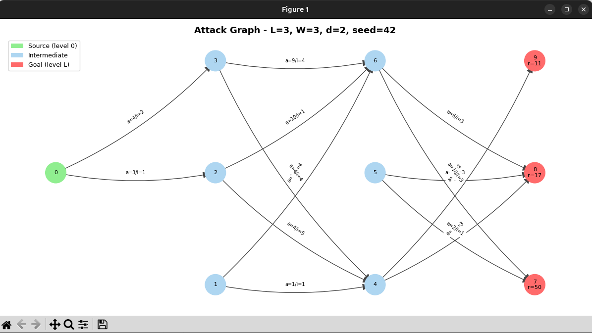
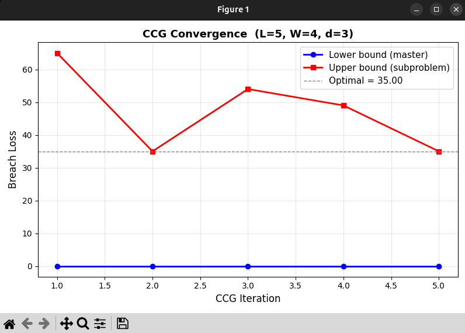

<h1>🔰 ThreatCut</h1>
<h3><em>Graph Interdiction & Cybersecurity Optimization Framework</em></h3>

 

A Python implementation of the bi-level defender-attacker optimisation model from:

> **Interdicting Attack Graphs to Protect Organizations from Cyber Attacks:
> A Bi-Level Defender–Attacker Model**
> 
> Apurba K. Nandi, Hugh R. Medal, Satish Vadlamani
> 
> *Computers & Operations Research*, Vol. 75, pp. 118–131, 2016
> 
> https://www.sciencedirect.com/science/article/abs/pii/S0305054816301113

---

## What This Project Does

An **attack graph** models all the ways an attacker can move through an
organisation's network, from an initial entry point to a high-value target
(database, admin account, critical system).  
Each arc in the graph represents an exploitation step; each goal node has a monetary or operational reward.

The **defender** has a limited budget and can *interdict* (block, patch,
or add a control to) a subset of arcs.  On the other side, the **attacker**, also budget-limited,
then picks the best remaining path to maximise the breach reward.

This is a classic **min-max bilevel optimisation** problem:

```
min_{x, budget}  max_{attack path p}  reward(p)  *  [p not blocked by x]
```

### Key Concepts

**Attack graph**: a DAG where nodes represent system states (access levels)
and arcs represent exploitation steps. The attacker moves from level 0
(initial foothold) to level L (goal asset).

**Interdiction**: the defender removes arcs from the graph by deploying
countermeasures (patches, firewalls, access controls). Each removal has a cost.

**Bilevel structure**: the defender moves first (outer problem), then the
attacker responds optimally (inner problem). This models an adversarial
setting where the attacker sees the defender's plan.

**Constraint-and-column generation (CCG)**: instead of solving the full
bilevel MIP at once (NP-hard), alternate between a *master problem*
(defender, with a growing set of attack path constraints) and a
*subproblem* (attacker, given the current defender plan). The master gives
a lower bound; the subproblem gives an upper bound. Convergence is
guaranteed when UB − LB ≤ ε.

This implementation provides:

| Component | File | Description                                      |
|-----------|------|--------------------------------------------------|
| Data structure | `model/attack_graph.py` | DAG with levels, arc costs, node rewards         |
| Graph generator | `data/generator.py` | Synthetic instances matching the paper's setup   |
| Attacker problem | `model/subproblem.py` | MAXBREACHBM - inner MIP solved with PuLP/CBC     |
| Exact bilevel | `model/bilevel.py` | Path-enumeration MIP for small instances         |
| CCG algorithm | `model/algorithm.py` | Constraint-and-column generation (_Algorithm 1_) |
| LP heuristic | `model/algorithm.py` | CCG with LP-relaxed master + greedy rounding     |
| Greedy heuristic | `model/algorithm.py` | Pure greedy arc selection                        |
| Single run | `main.py` | Solve one instance, show convergence plot        |
| Experiments | `experiments/run_experiments.py` | Reproduce Tables 3-5 of the paper                |

---

## Installation

```bash
# Clone or download the project
cd ThreatCut

# Create and activate a virtual environment (recommended)
python3 -m venv .venv
source .venv/bin/activate       # macOS / Linux
# .venv\Scripts\activate        # Windows

# Install dependencies
uv sync
```

The only solver required is **CBC**, which ships bundled inside `pulp` -
no licence or external installation needed.  If you have access to Gurobi
(free academic licence), replace `pulp.PULP_CBC_CMD` with `pulp.GUROBI_CMD`
in `model/algorithm.py` and `model/subproblem.py` for significantly faster
solving on large instances.

---

## Quick Start

### 1. Verify the generator works

```bash
python3 data/generator.py
```

Expected output:
```
Generating a small graph (L=3, W=3, d=2, seed=42)...
AttackGraph: 10 nodes, ... arcs, 4 levels
  Source nodes : [0]
  Goal nodes   : [7, 8, 9]  (rewards: [34.0, 21.0, 47.0])
  All paths: [[0, 1, 4, 7], [0, 1, 4, 8], ...]
```

A matplotlib window will open showing the graph, for example:




---

### 2. Solve a single instance (default parameters)

```bash
python3 main.py
```

This generates a random graph with `L=3, W=3, d=2, B_defender=10,
B_attacker=15, seed=42`, solves it with all three methods, prints a
comparison table, and shows the CCG convergence plot.

Expected output:
```
Generating attack graph: L=3, W=3, d=2, seed=42
AttackGraph: 10 nodes, 12 arcs, 4 levels
  Defender budget : 10.0
  Attacker budget : 15.0
  All paths       : 8

Solving with Exact CCG ...
Solving with LP heuristic ...
Solving with Greedy heuristic ...

==============================================================
Method                  Breach Loss    Gap%  Time (s)  Iter
--------------------------------------------------------------
Exact CCG                    25.0000      —     0.123     3
LP heuristic                 25.0000   0.00%    0.045     —
Greedy heuristic             30.0000  20.00%    0.002     —
==============================================================

Optimal interdiction plan (CCG): [(2, 5), (3, 6)]
CCG converged in 3 iteration(s)
```

---

### 3. Custom parameters

```bash
# Larger instance
python3 main.py --L 5 --W 4 --d 3 --B_def 25 --B_att 30 --seed 7

# Draw the graph before solving
python3 main.py --L 3 --W 3 --d 2 --draw

# Save the convergence plot to a file
python3 main.py --save_plot convergence.png

# Skip the plot entirely (useful for scripting)
python3 main.py --no_plot

# Validate CCG result against the small exact bilevel MIP
python3 main.py --L 3 --W 3 --d 2 --validate
```

And the relative matplotlib window, such as:



---

### 4. Reproduce the paper's experiments

```bash
# Quick subset — 3 parameter combinations, 10 instances each (~2 min)
python3 experiments/run_experiments.py --quick

# Full experiment — 10 combinations, 10 instances each (~15–30 min)
python3 experiments/run_experiments.py

# Save all results to CSV (already committed to this repo)
python3 experiments/run_experiments.py --csv results.csv

# Fewer instances for a faster run
python3 experiments/run_experiments.py --quick --instances 3
```

The output table has the same structure as Tables 3-5 of the paper:
average breach loss, CCG iterations, solve time, and optimality gap
for each method across all instances.

---

## What to Verify

### After `data/generator.py`
- Graph has exactly `1 + L * W` nodes
- Source node has id `0`, goal nodes are at the last level
- Each non-source, non-goal node has exactly `d` outgoing arcs (clamped to W)
- Arc costs are integers in the stated ranges

### After `main.py` (default)
- CCG terminates in a few iterations (typically 2–5 for small graphs)
- Lower bound increases monotonically, upper bound decreases monotonically
- At convergence: `|upper_bound - lower_bound| < 1e-4`
- LP heuristic gives the same or slightly worse loss than exact CCG
- Greedy heuristic is fastest but has the largest gap

### After `--validate`
- `CCG breach_loss ≈ bilevel MIP breach_loss` (should match within 1e-4)
- If they differ, there is a bug in either the master or the subproblem

### After the experiments
- Results should qualitatively match Tables 3–5 of the paper:
  - Larger graphs (higher L, W) take more CCG iterations
  - LP heuristic gap is typically < 5%
  - Greedy heuristic gap is higher but runtime is near zero

---

## Project Structure

```
ThreatCut/
├── data/
│   ├── __init__.py
│   └── generator.py          # Synthetic graph generation + visualisation
├── model/
│   ├── __init__.py
│   ├── attack_graph.py       # AttackGraph data structure
│   ├── subproblem.py         # Attacker inner problem (MAXBREACHBM)
│   ├── bilevel.py            # Small-instance exact bilevel MIP
│   └── algorithm.py          # CCG + LP heuristic + Greedy heuristic
├── experiments/
│   ├── __init__.py
│   └── run_experiments.py    # Full computational experiment
├── static/                   # Images
├── main.py                   # Single-instance entry point
├── results.csv               # csv with the results of the paper experiment
├── pyproject.toml
├── uv.lock
├── .gitignore
├── .python-version
├── LICENCE
└── README.md
```

---
## 📜 License

MIT License, with reference to the paper cited above.

---